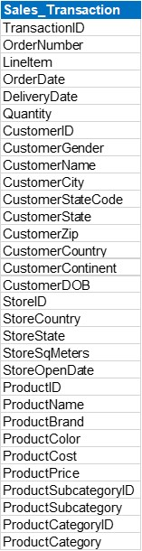

# Data Normalization using Power Query

## Table of Contents

- [Overview](#overview)
- [Normalizing vs. Denormalizing Data](#normalizing-vs-denormalizing-data)
- [Benefits of Data Normalization](#benefits-of-data-normalization)
- [Data Sources](#data-source)
- [Tools](#tools)
- [Data Cleaning/Transfromation](#data-cleaning-and-transformation)

### Overview

This is a demo of normalizing data using Power Query in Excel or PowerBI to create Fact and Dimension tables.
- **Fact Table:** Stores quantitative data about the business transactions.
- **Dimension Table:** Stores descriptive attributes that provide context to the Fact table

### Normalizing vs. Denormalizing Data
- **Denormalizing Data:** Combining data from multiple tables into one flat table.
- **Normalized Data**: A process involves breaking down large tables into smaller, related tables and establishing relationships between them.

Example of a Denormalized table:
>

### Benefits of Data Normalization

- **Consistency:** It ensures that the same data standards are applied across different datasets.
- **Error Reduction:** Minimizes the likelihood of errors that can arise from dealing with data
- **Improve Analysis Quality:** Yield more accurate results as the scale of the input data does not skew them.

### Data Source

The primary dataset used for this exercise is the "sales_transaction.xlsx" file, containing detailed information about each sale made by the company.

### Tools

- Excel: For the data source
- Power Query: For the data cleaning and transformation.

### Data Cleaning and Transformation

In the data preparation phase, we will perform the following tasks:

1. Data loading and inspection.
2. Setting up data in a tabular format.
3. Organize the dataset with Rows representing records and Columns representing variables.
4. Check and correct data types.

## TO be continued...
