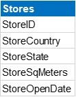
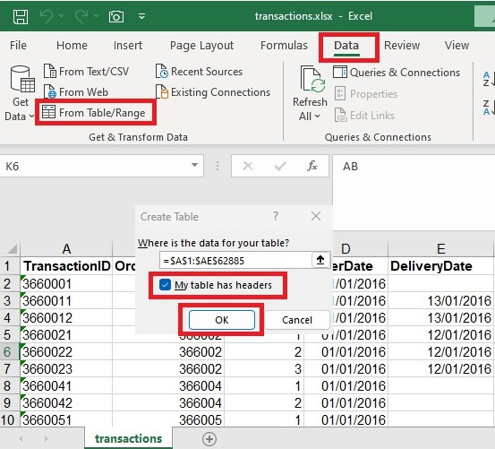

# Data Normalization using Power Query

## Table of Contents

- [Overview](#overview)
- [Normalizing vs. Denormalizing Data](#normalizing-vs-denormalizing-data)
- [Benefits of Data Normalization](#benefits-of-data-normalization)
- [Data Sources](#data-source)
- [Tools](#tools)
- [Data Cleaning/Transfromation](#data-cleaning-and-transformation)

### Overview

This is a demo of normalizing data using Power Query in Excel or PowerBI to create Fact and Dimension tables.
- **Fact Table:** Stores quantitative data about the business transactions.
- **Dimension Table:** Stores descriptive attributes that provide context to the Fact table

### Normalizing vs. Denormalizing Data
- **Denormalizing Data:** Combining data from multiple tables into one flat table.
- **Normalized Data**: A process involves breaking down large tables into smaller, related tables and establishing relationships between them.

<i>Example of a Denormalized table:</i>
>

>
>
<i>Example of a Normalized table:</i>
>
&emsp;&emsp;&emsp;&emsp;&emsp;&emsp;

### Benefits of Data Normalization

- **Consistency:** It ensures that the same data standards are applied across different datasets.
- **Error Reduction:** Minimizes the likelihood of errors that can arise from dealing with data
- **Improve Analysis Quality:** Yield more accurate results as the scale of the input data does not skew them.

### Data Source

The primary dataset used for this exercise is the "transactions.xlsx" file, containing detailed information about each sale made by the company.

### Tools

- Excel: For the data source
- Power Query: For the data cleaning and transformation.

### Data Cleaning and Transformation

In the data preparation phase, we will perform the following tasks:

1. Data loading and inspection.
   >
   - Open the "transaction.xlsx" file.
   >
   &emsp;
   >
   - Select data in any cell -> Go to **Data** tab -> Select **From Table/Range** -> Check **My table has headers** and click **OK**
   >
   &emsp;
   >
   - **Power Query Editor** window will open -> Right click on the **Table1** -> Select **Duplicate**, create another six (6) copies of the table -> Rename each table according to its data and attributes.
   >
   &emsp;
   >
   - The most common normal forms include:
      - **First normal form (1NF):** Eliminates duplicate columns within a table and ensures each column contains atomic (indivisible) values.
      - **Second normal form (2NF):** Meets the requirements of 1NF and removes partial dependencies by ensuring that all non-key attributes are fully functionally dependent on the primary key.
      - **Third normal form (3NF):** Meets the requirements of 2NF and eliminates transitive dependencies by ensuring that non-key attributes are not dependent on other non-key attributes.
   >
   These normal forms address different types of data redundancies and dependencies.
   >
2. Setting up data in a tabular format and organize the dataset with Rows representing records and Columns representing variables.
   >
   &emsp;
   >
3. Check and correct data types.
   >
   &emsp;
   >
   &emsp;
   >
### Conclusion

Normalized data is organized into multiple related tables, each with a specific purpose, minimizing data redundancy and dependency.
Denormalized data consolidates data into a single flat table to optimize data retrieval. 
Normalization prioritizes data integrity, while denormalization prioritizes query performance.

### References
<a href="https://learn.microsoft.com/en-us/office/troubleshoot/access/database-normalization-description" target="_blank">https://learn.microsoft.com/en-us/office/troubleshoot/access/database-normalization-description</a>
https://www.datacamp.com/tutorial/normalization-in-sql

